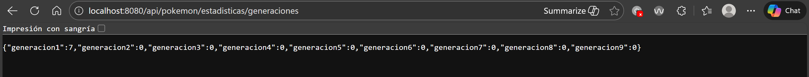
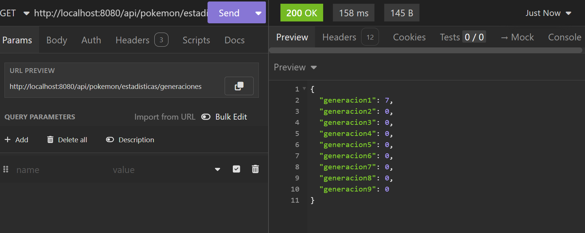

# 1.¿Qué endpoint has creado y por qué?

He creado un endpoint que hace que veas todos los pokémons que hay en la base de datos de cada generación.

**URL:** `GET /api/pokemon/estadisticas/generaciones`

Lo he hecho porque se necesitaba saber cuántos pokémons hay por cada generación (1-9). Esto ayuda a saber si falta alguno o no, ya que te dice el número exacto de pokémons que hay en cada una.

**Arquitectura por capas:**

- **Controlador** (`PokemonController.java`): Recibe la petición GET y llama al servicio.
- **Servicio** (`PokemonService.java`): Contiene el método `contarPorGeneracion()` que recorre las 9 generaciones y pide al repositorio el conteo de cada una.
- **Repositorio** (`PokemonRepository.java`): Tiene el método `countByGeneracion(Integer generacion)` que hace la consulta a la base de datos.

# 2.¿Cómo has implementado la seguridad?

El proyecto usa **JWT** con **Spring Security**. Funciona así:

1. El usuario se registra o inicia sesión en `/api/auth/login` y recibe un token JWT.
2. Ese token se envía en la cabecera `Authorization: Bearer <token>` en cada petición.
3. El filtro `JwtAuthenticationFilter` intercepta las peticiones y valida el token.
4. En `SecurityConfig.java` se definen los permisos:
   - **GET públicos**: Los endpoints de consulta (listar pokémons, tipos, estadísticas) son accesibles sin token.
   - **POST/PUT**: Requieren rol USER o ADMIN (necesitas estar logueado).
   - **DELETE**: Solo ADMIN puede borrar pokémons.

El endpoint de estadísticas de generaciones está configurado como público (`permitAll`) porque es solo una consulta de lectura que no modifica datos ni expone información sensible.

# 3.Capturas o comandos para probarlo:

(Las capturas están tomadas de Insomnia y del navegador)

La URL para probarlo es: http://localhost:8080/api/pokemon/estadisticas/generaciones

URL en el navegador:

Se puede observar como por cada generación hay un número específico de pokémons en la base de datos.

Prueba en Insomnia:

Esto verifica que el endpoint funciona correctamente, ya que recibo lo que pido sin problemas.

