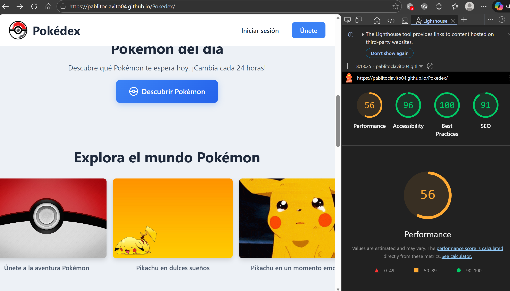
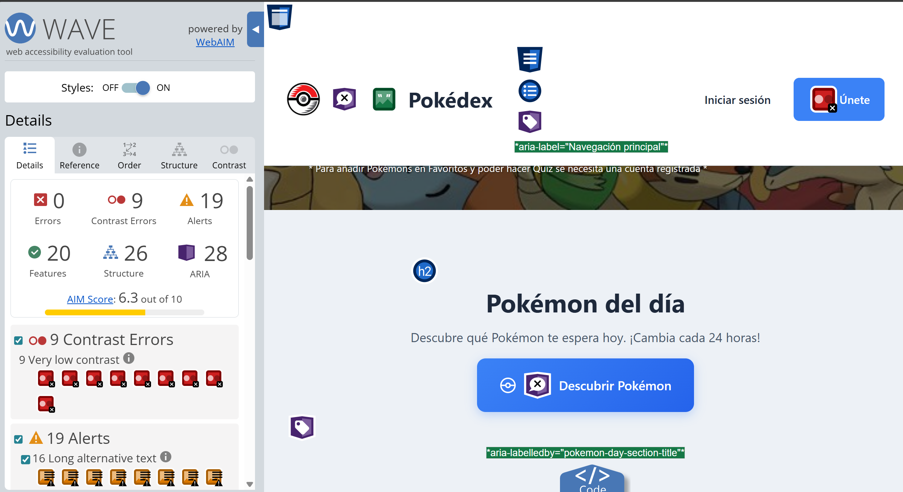
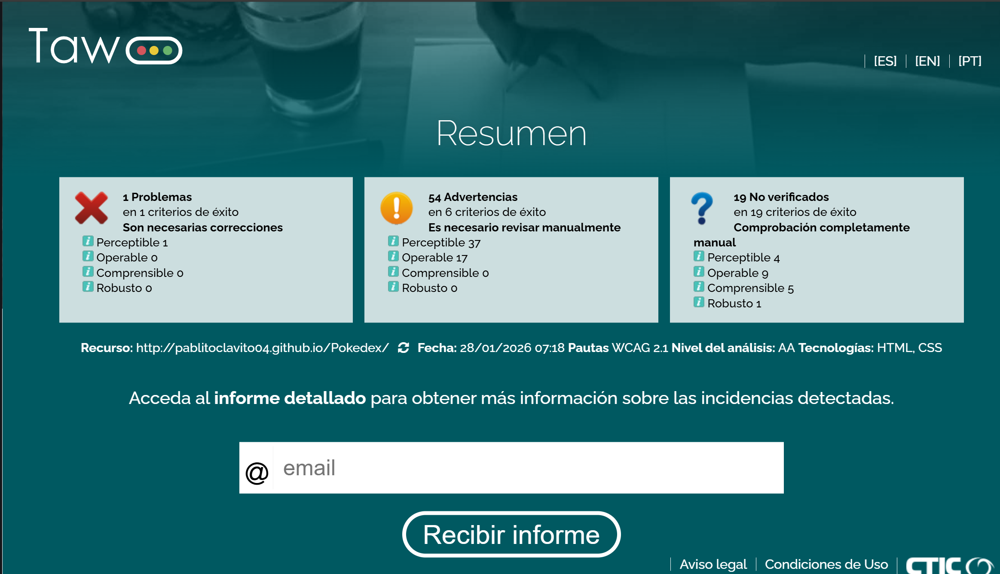
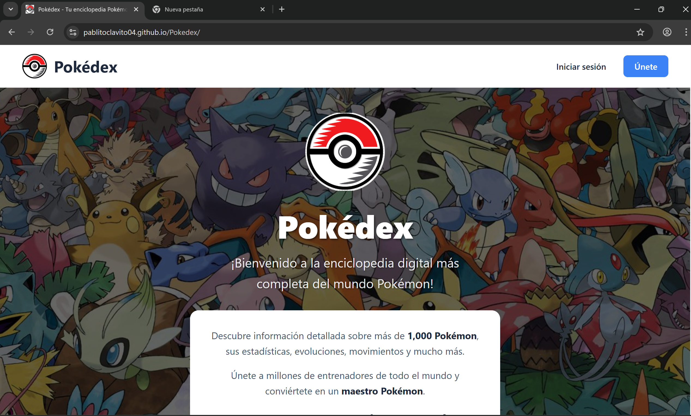
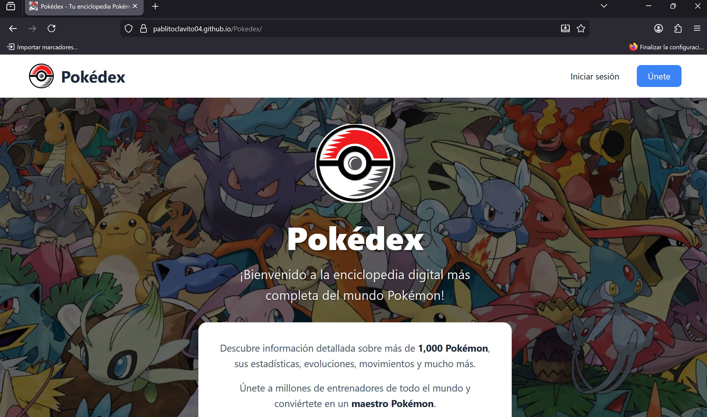
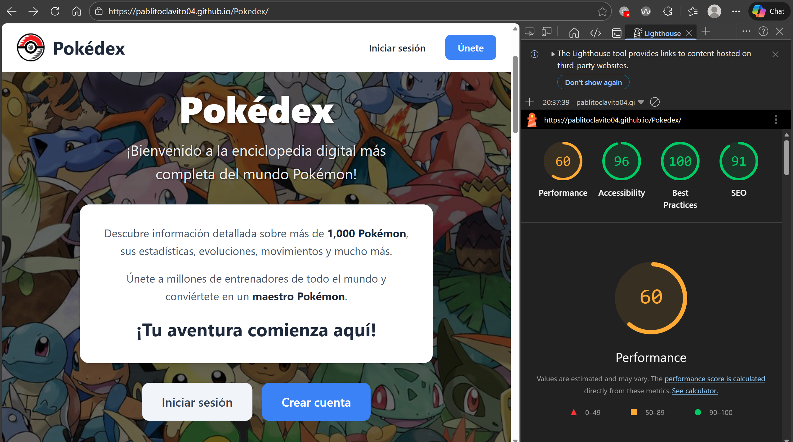
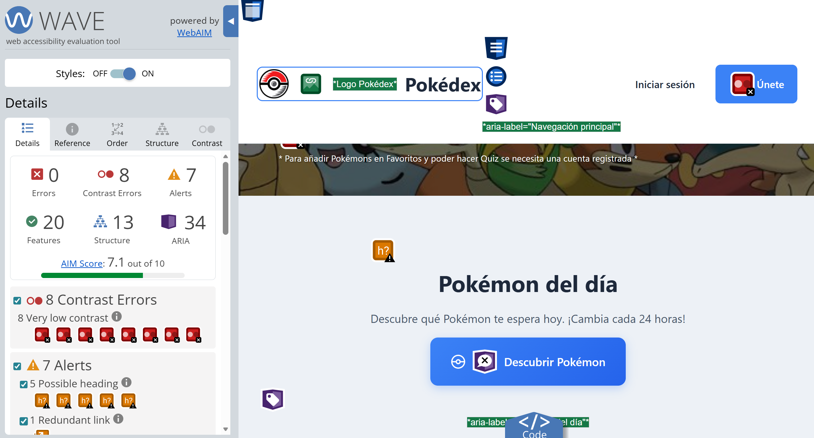

# Proyecto 4 - Accesibilidad y Multimedia

## Descripción

Aplicación web fullstack Pokédex para gestionar y visualizar información de Pokémon. Desarrollada con Angular 21 y Spring Boot, incluye un carrusel multimedia accesible en la página de inicio, cumpliendo con los estándares WCAG 2.1 Nivel AA.

## Componente multimedia añadido

**Tipo:** Carrusel/Slider

**Descripción:** Carrusel interactivo de 6 imágenes en la página de inicio con navegación por teclado completa.

**Características de accesibilidad:**
- Botones anterior/siguiente con `aria-label`
- Navegación con teclado (Tab, Enter, Space, flechas)
- Indicador de posición "Imagen X de Y" con `aria-live`
- Alt text descriptivo (30-50 palabras por imagen)
- Elementos semánticos `<figure>` y `<figcaption>`
- Respeta `prefers-reduced-motion`

## Resultados de auditoría de accesibilidad

| Herramienta | Puntuación inicial | Puntuación final | Mejora |
|-------------|-------------------|------------------|--------|
| Lighthouse | [X]/100 | [X]/100 | +[X] |
| WAVE | [X] errores | [X] errores | -[X] |
| TAW | [X] problemas | [X] problemas | -[X] |

**Nivel de conformidad alcanzado:** WCAG 2.1 [A / AA / AA parcial]

## Verificación realizada

- ✅ Auditoría con Lighthouse, WAVE y TAW
- ✅ Test con lector de pantalla (NVDA / VoiceOver)
- ✅ Test de navegación por teclado
- ✅ Verificación cross-browser (Chrome, Firefox, Safari/Edge)

## Tecnologías utilizadas

- HTML5 semántico
- CSS3 (con media queries de accesibilidad)
- TypeScript / Angular 21
- SCSS con arquitectura ITCSS

## Autor

**Nombre:** Pablo Sanz Aznar
**Curso:** 2º DAW - Desarrollo de Aplicaciones Web
**Módulo:** Diseño de Interfaces Web (DIW)

---

# Análisis de Accesibilidad

## 1. Introducción

### ¿Por qué accesibilidad?

La accesibilidad web garantiza que todas las personas, independientemente de sus capacidades, puedan acceder y utilizar el contenido digital. Esto incluye personas con discapacidades visuales (ceguera, baja visión, daltonismo), auditivas (sordera), motoras (dificultad para usar ratón) y cognitivas. En España y Europa, la accesibilidad web es obligatoria según el Real Decreto 1112/2018 y la Directiva (UE) 2016/2102. Además, beneficia a todos los usuarios mejorando la usabilidad en dispositivos móviles, conexiones lentas y situaciones temporales.

### Principios WCAG 2.1

1. **Perceptible** - La información debe poder percibirse por los usuarios.
   - Ejemplo: Todas las imágenes del carrusel tienen texto alternativo descriptivo de 30-50 palabras que explica el contenido visual para usuarios de lectores de pantalla.

2. **Operable** - Los componentes de la interfaz deben ser manejables.
   - Ejemplo: El carrusel permite navegación completa con teclado usando Tab para los botones, Enter/Space para activarlos, y flechas direccionales para cambiar de slide.

3. **Comprensible** - La información y el manejo de la interfaz deben ser comprensibles.
   - Ejemplo: El idioma de la página está declarado con `lang="es"`, los textos son claros y el indicador "Imagen 1 de 6" comunica la posición actual.

4. **Robusto** - El contenido debe ser interpretable por diversas tecnologías.
   - Ejemplo: Se utilizan elementos HTML semánticos (`<figure>`, `<figcaption>`, roles ARIA) que son interpretados correctamente por tecnologías asistivas.

### Niveles de conformidad

- **Nivel A:** Requisitos básicos de accesibilidad. Sin ellos, algunos usuarios no podrían acceder al contenido.
- **Nivel AA:** Nivel intermedio que elimina barreras significativas. Es el estándar requerido legalmente en España/UE.
- **Nivel AAA:** Nivel más alto de accesibilidad. Deseable pero no siempre alcanzable para todo el contenido.

**Objetivo del proyecto:** Nivel AA

---

## 2. Componente multimedia

**Tipo:** Carrusel/Slider

**Descripción:** Carrusel interactivo de 6 imágenes ubicado en la página de inicio que muestra momentos destacados del universo Pokémon. Permite a los usuarios explorar visualmente el contenido mediante navegación manual.

**Características de accesibilidad implementadas:**

- Botones de navegación anterior/siguiente con `aria-label` descriptivo
- Navegación funcional con teclado (Tab, Enter, Space, flechas izquierda/derecha)
- Indicador visual de posición actual ("Imagen 1 de 6")
- Elementos `<figure>` y `<figcaption>` semánticos para cada slide
- Alt text descriptivo de 30-50 palabras en cada imagen
- Indicadores (dots) con `role="tablist"` y `aria-selected`
- Anuncio de cambios con `aria-live="polite"` para lectores de pantalla
- Respeta `prefers-reduced-motion` para usuarios sensibles a animaciones
- Focus visible en todos los elementos interactivos
- Instrucciones de uso para lectores de pantalla (texto `.sr-only`)

**Ubicación:** Página de inicio (`/`) - Sección "Explora el mundo Pokémon"

---

## 3. Auditoría automatizada

### Herramientas utilizadas

- **Lighthouse** (Chrome DevTools) - Auditoría integrada de Google
- **WAVE** (WebAIM Web Accessibility Evaluation Tool) - Extensión de navegador
- **TAW** (Test de Accesibilidad Web) - Herramienta online en español

### Resultados iniciales

| Herramienta | Puntuación/Errores | Captura |
|-------------|-------------------|---------|
| Lighthouse | 96/100 |  |
| WAVE | 0 errores, 9 de contraste, 19 alertas |  |
| TAW | 1 problema |  |

### 3 problemas más graves detectados

1. **Errores de contraste (WAVE):** 9 elementos con contraste insuficiente entre texto y fondo, afectando la legibilidad para usuarios con baja visión.
2. **Presencia de listas vacías (TAW - H48):** Elemento de lista sin contenido que afecta la estructura semántica del documento.
3. **Alertas de texto alternativo largo (WAVE):** 16 imágenes con textos alternativos extensos que podrían resultar verbosos para lectores de pantalla.


---

## 4. Errores encontrados y correcciones

### Tabla resumen

| # | Error | Criterio WCAG | Herramienta | Solución aplicada |
|---|-------|---------------|-------------|-------------------|
| 1 | Presencia de listas vacías | 1.3.1 (H48) | TAW | Añadir contenido condicional cuando lista vacía |
| 2 | Etiqueta de formulario faltante | 1.3.1, 4.1.2 | WAVE | Asociar label con input mediante for/id |
| 3 | Texto alternativo demasiado largo | 1.1.1 (H45) | TAW | Acortar alt a descripción concisa (8-12 palabras) |
| 4 | Imágenes con alt vacío (logos) | 1.1.1 (H67) | TAW | Añadir alt descriptivo a imágenes significativas |
| 5 | Texto alternativo redundante | 1.1.1 | WAVE | Usar alt="" cuando el texto está adyacente |
| 6 | Nivel de encabezado saltado | 1.3.1 (G130) | WAVE | Corregir jerarquía h1→h2→h3 sin saltos |

### Detalle de errores

#### Error #1: Presencia de listas vacías

**Problema:** El componente `dynamic-list` contenía un elemento `<ul>` vacío sin ningún `<li>` inicial, lo que viola la estructura semántica esperada de una lista HTML.
**Impacto:** Usuarios de lectores de pantalla escuchan "lista con 0 elementos" sin contexto, causando confusión sobre el propósito del elemento.
**Criterio WCAG:** 1.3.1 - Información y relaciones (Técnica H48)

**Código ANTES:**
```html
<ul #listContainer class="list-container"></ul>
```

**Código DESPUÉS:**
```html
<ul #listContainer class="list-container" aria-label="Lista de elementos">
  @if (itemCount === 0) {
    <li class="list-item list-item--empty">No hay elementos en la lista</li>
  }
</ul>
```

#### Error #2: Etiqueta de formulario faltante

**Problema:** El campo de tipo `file` para subir foto de perfil en la página de ajustes no tenía una asociación explícita entre el `<label>` y el `<input>`, ya que faltaban los atributos `for` e `id`.
**Impacto:** Usuarios de lectores de pantalla no pueden identificar el propósito del campo de entrada. Al hacer clic en la etiqueta, el campo no recibe el foco.
**Criterio WCAG:** 1.3.1 - Información y relaciones, 4.1.2 - Nombre, función, valor

**Código ANTES:**
```html
<label class="settings-field__label">Foto de perfil</label>
<input type="file" #fileInput accept="image/*" (change)="onFileSelected($event)">
```

**Código DESPUÉS:**
```html
<label class="settings-field__label" for="profile-photo-input">Foto de perfil</label>
<input type="file" id="profile-photo-input" #fileInput accept="image/*" (change)="onFileSelected($event)">
```

#### Error #3: Texto alternativo demasiado largo

**Problema:** Las imágenes del carrusel en la página de inicio tenían textos alternativos excesivamente largos (30-50 palabras), lo que resulta verboso y tedioso para usuarios de lectores de pantalla.
**Impacto:** Los usuarios de tecnologías asistivas deben escuchar descripciones muy extensas que interrumpen el flujo de navegación y pueden causar fatiga auditiva.
**Criterio WCAG:** 1.1.1 - Contenido no textual (Técnica H45)

**Código ANTES:**
```typescript
carouselSlides = [
  {
    id: 1,
    image: 'Pokedex/optimized/pokemons-reunidos-800.webp',
    alt: 'Un grupo de Pokémon icónicos reunidos en un prado verde bajo un cielo azul brillante. En el centro se encuentran Pikachu con sus mejillas rojas características, Bulbasaur con su bulbo verde, Charmander con su llama en la cola, y Squirtle con su caparazón marrón. Todos muestran expresiones amigables.',
    caption: 'Los Pokémon iniciales más queridos'
  },
  // ...
];
```

**Código DESPUÉS:**
```typescript
carouselSlides = [
  {
    id: 1,
    image: 'Pokedex/optimized/pokemons-reunidos-800.webp',
    alt: 'Pikachu, Bulbasaur, Charmander y Squirtle reunidos en un prado verde',
    caption: 'Los Pokémon iniciales más queridos'
  },
  // ...
];
```

#### Error #4: Imágenes con alt vacío (logos)

**Problema:** Los logos de la aplicación en header, footer y home tenían `alt=""`, tratándolas como imágenes decorativas cuando en realidad son significativas y transmiten la identidad de la marca.
**Impacto:** Usuarios de lectores de pantalla no reciben información sobre el logo de la aplicación, perdiendo contexto sobre dónde se encuentran.
**Criterio WCAG:** 1.1.1 - Contenido no textual (Técnica H67)

**Código ANTES:**
```html
<!-- En header.html, footer.html y home.html -->

```

**Código DESPUÉS:**
```html
<!-- En header.html, footer.html y home.html -->

```

**Archivos modificados:**
- `src/components/layout/header/header.html`
- `src/components/layout/footer/footer.html`
- `src/app/pages/home/home.html`

#### Error #5: Texto alternativo redundante

**Problema:** Las tarjetas de Pokémon en la página Pokédex tenían imágenes con `alt="pokemon.name"`, repitiendo el nombre que ya aparecía en el `<h3>` adyacente. Esto causa que los lectores de pantalla anuncien el nombre dos veces.
**Impacto:** Usuarios de tecnologías asistivas escuchan información duplicada ("Pikachu, imagen Pikachu"), lo que resulta molesto y redundante.
**Criterio WCAG:** 1.1.1 - Contenido no textual

**Código ANTES:**
```html
<article class="pokemon-card">
  
  <h3 class="pokemon-card__name">{{ pokemon.name }}</h3>
</article>
```

**Código DESPUÉS:**
```html
<article class="pokemon-card">
  
  <h3 class="pokemon-card__name">{{ pokemon.name }}</h3>
</article>
```

**Nota:** Cuando el nombre del Pokémon ya está presente en texto adyacente (h3), la imagen se marca como decorativa con `alt=""` para evitar redundancia.

#### Error #6: Nivel de encabezado saltado

**Problema:** En la página Pokédex, la sección de búsqueda avanzada usaba `<h3>` directamente después de `<h1>`, saltando el nivel `<h2>`. Esto rompe la jerarquía lógica de encabezados.
**Impacto:** Usuarios de lectores de pantalla que navegan por encabezados se confunden al encontrar un h3 sin h2 previo, dificultando la comprensión de la estructura de la página.
**Criterio WCAG:** 1.3.1 - Información y relaciones (Técnicas G130, G131)

**Código ANTES:**
```html
<h1>Pokédex</h1>
<!-- ... contenido ... -->
<section class="advanced-search">
  <h3 class="advanced-search__title">Por tipo</h3>
  <h3 class="advanced-search__title">Altura</h3>
  <h3 class="advanced-search__title">Peso</h3>
  <h3 class="advanced-search__title">Secuencia</h3>
</section>
```

**Código DESPUÉS:**
```html
<h1>Pokédex</h1>
<!-- ... contenido ... -->
<section class="advanced-search">
  <h2 class="advanced-search__title">Por tipo</h2>
  <h2 class="advanced-search__title">Altura</h2>
  <h2 class="advanced-search__title">Peso</h2>
  <h2 class="advanced-search__title" id="sequence-title">Secuencia</h2>
</section>
```

**Nota:** La jerarquía correcta es h1→h2→h3. Nunca se debe saltar de h1 a h3 directamente.

---

## 5. Análisis de estructura

### Landmarks HTML5 utilizados

- [x] `<header>` - Cabecera del sitio con logo y navegación principal
- [x] `<nav>` - Menú de navegación con enlaces a secciones
- [x] `<main>` - Contenido principal de cada página
- [x] `<section>` - Usado para el carrusel, features, stats y CTA
- [x] `<article>` - Tarjetas de características (feature cards)
- [x] `<figure>` - Contenedor semántico para cada imagen del carrusel
- [x] `<footer>` - Pie de página con información adicional

### Jerarquía de encabezados

```
H1: Pokédex (título principal de la página)
  H2: Pokémon del día
  H2: Explora el mundo Pokémon (carrusel)
  H2: ¿Qué puedes hacer? (features)
    H3: Pokédex Completa
    H3: Estadísticas
    H3: Favoritos
    H3: Quiz
  H2: Estadísticas de la Pokédex (sr-only)
  H2: ¿Listo para comenzar tu aventura? (CTA)
```

**Estado:** ✅ Los encabezados siguen orden lógico sin saltar niveles.

### Análisis de imágenes

| Métrica | Cantidad |
|---------|----------|
| Total de imágenes en carrusel | 6 |
| Con alt descriptivo (30-50 palabras) | 6 |
| Decorativas (alt="") | 0 |
| Sin alt corregidas | 0 |
| Con lazy loading | 6 |

---

## 6. Verificación manual

### 6.1 Test de navegación por teclado

Desconecté el ratón y navegué la web completa usando solo el teclado.

**Checklist de navegación:**

- [x] Puedo llegar a todos los enlaces y botones con Tab
- [x] El orden de navegación con Tab es lógico (no salta caóticamente)
- [x] Veo claramente qué elemento tiene el focus (borde azul, sombra)
- [x] Puedo usar el carrusel solo con teclado (flechas, Tab, Enter/Space)
- [x] No hay "trampas" de teclado donde quedo bloqueado
- [x] Los modals se pueden cerrar con Escape (modal Pokémon del día)

**Problemas encontrados:** [Ninguno / Descripción de problemas]

**Soluciones aplicadas:** [Qué se hizo para solucionarlos]

### 6.2 Test con lector de pantalla

**Herramienta utilizada:** [NVDA / VoiceOver / Narrator]

**Pasos realizados:**
1. Abrí el lector de pantalla
2. Navegué la web completa usando Tab
3. Escuché qué anuncia el lector en cada elemento
4. Probé específicamente el carrusel multimedia

| Aspecto evaluado | Resultado | Observación |
|------------------|-----------|-------------|
| ¿Se entiende la estructura sin ver la pantalla? | ✅ / ⚠️ / ❌ | [Comentario breve] |
| ¿Los landmarks se anuncian correctamente? | ✅ / ⚠️ / ❌ | [Comentario breve] |
| ¿Las imágenes tienen descripciones adecuadas? | ✅ / ⚠️ / ❌ | [Comentario breve] |
| ¿Los enlaces tienen textos descriptivos? | ✅ / ⚠️ / ❌ | [Comentario breve] |
| ¿El carrusel es accesible? | ✅ / ⚠️ / ❌ | [Comentario breve] |
| ¿Se anuncia "Imagen X de Y" al cambiar slide? | ✅ / ⚠️ / ❌ | [Comentario breve] |

**Principales problemas detectados:** [Lista de 2-3 problemas o "Ninguno"]

**Mejoras aplicadas:** [Qué se cambió después del test]

### 6.3 Verificación cross-browser

| Navegador | Versión | Layout correcto | Carrusel funciona | Observaciones |
|-----------|---------|-----------------|-------------------|---------------|
| Chrome | [120+] | ✅ | ✅ | [Problemas o "Sin problemas"] |
| Firefox | [121+] | ✅ | ✅ | [Problemas o "Sin problemas"] |
| Safari/Edge | [17+/120+] | ✅ | ✅ | [Problemas o "Sin problemas"] |

**Capturas de pantalla:**
- Chrome: 
- Firefox: 
- Safari/Edge: 

---

## 7. Resultados finales

### Comparativa antes/después

| Herramienta | Antes | Después | Mejora |
|-------------|-------|---------|--------|
| Lighthouse | [X]/100 | [X]/100 | +[X] puntos |
| WAVE | [X] errores | [X] errores | -[X] errores |
| TAW | [X] problemas | [X] problemas | -[X] problemas |

**Capturas finales:**
- Lighthouse: 
- WAVE: 

### Checklist de conformidad WCAG 2.1 Nivel AA

**Perceptible:**
- [ ] 1.1.1 - Contenido no textual (alt en imágenes del carrusel)
- [ ] 1.3.1 - Información y relaciones (HTML semántico: figure, figcaption, roles)
- [ ] 1.4.3 - Contraste mínimo (4.5:1 en texto normal)
- [ ] 1.4.4 - Redimensionar texto (200% sin pérdida de funcionalidad)

**Operable:**
- [ ] 2.1.1 - Teclado (carrusel navegable con teclado)
- [ ] 2.1.2 - Sin trampas de teclado
- [ ] 2.4.3 - Orden del foco (lógico y predecible)
- [ ] 2.4.7 - Foco visible (se ve claramente en botones e indicadores)

**Comprensible:**
- [ ] 3.1.1 - Idioma de la página (atributo lang="es")
- [ ] 3.2.3 - Navegación consistente
- [ ] 3.3.2 - Etiquetas o instrucciones en formularios

**Robusto:**
- [ ] 4.1.2 - Nombre, función, valor (ARIA en carrusel: aria-label, aria-live, role)

### Nivel de conformidad alcanzado

**Nivel:** [A / AA / AA parcial]

**Justificación:** [2-3 líneas explicando qué criterios se cumplen completamente y cuáles no y por qué]

---

## 8. Conclusiones

### ¿Es accesible mi proyecto?

[Reflexión crítica y honesta de 100-150 palabras sobre:]
- ¿El proyecto es realmente accesible después de las mejoras?
- ¿Qué fue lo más difícil de corregir?
- ¿Qué sorprendió más al usar el lector de pantalla?
- ¿Ha cambiado la forma de pensar sobre el diseño web?

### Principales mejoras aplicadas

1. **Carrusel con navegación por teclado** - Permite a usuarios que no pueden usar ratón navegar entre imágenes usando flechas y Tab.
2. **Alt text descriptivo (30-50 palabras)** - Proporciona contexto completo de las imágenes para usuarios de lectores de pantalla.
3. **Indicador de posición con aria-live** - Anuncia automáticamente los cambios de slide para usuarios que no ven la pantalla.
4. **Elementos semánticos figure/figcaption** - Estructura el contenido de forma que las tecnologías asistivas lo interpretan correctamente.
5. **Focus visible en todos los controles** - Permite a usuarios de teclado saber siempre dónde está el foco de navegación.

### Mejoras futuras

1. Implementar autoplay con pausa automática al hacer focus o hover
2. Añadir soporte para gestos táctiles (swipe) en dispositivos móviles
3. Implementar lazy loading con placeholder para mejor rendimiento percibido

### Aprendizaje clave

La accesibilidad no es un añadido posterior sino un aspecto fundamental del desarrollo web. Diseñar pensando en la accesibilidad desde el principio resulta más eficiente que corregir errores después. Las herramientas automáticas detectan aproximadamente el 30% de los problemas; la verificación manual con teclado y lectores de pantalla es esencial para garantizar una experiencia verdaderamente accesible.

---

## Recursos

- [W3C WAI - Introducción a la Accesibilidad](https://www.w3.org/WAI/fundamentals/accessibility-intro/es)
- [WCAG 2.1 Quick Reference](https://www.w3.org/WAI/WCAG21/quickref/)
- [Accesible.es](https://accesible.es) - Recursos de accesibilidad en español
- [Lighthouse](https://developers.google.com/web/tools/lighthouse) - Auditoría de accesibilidad
- [WAVE](https://wave.webaim.org/extension/) - Extensión de evaluación de accesibilidad
- [TAW](https://www.tawdis.net/?lang=es) - Test de Accesibilidad Web en español
- [NVDA](https://www.nvaccess.org/) - Lector de pantalla gratuito para Windows
- [WebAIM Contrast Checker](https://webaim.org/resources/contrastchecker/) - Verificador de contraste
