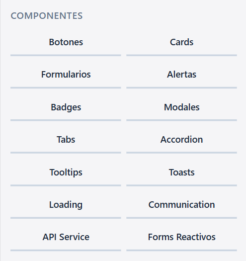
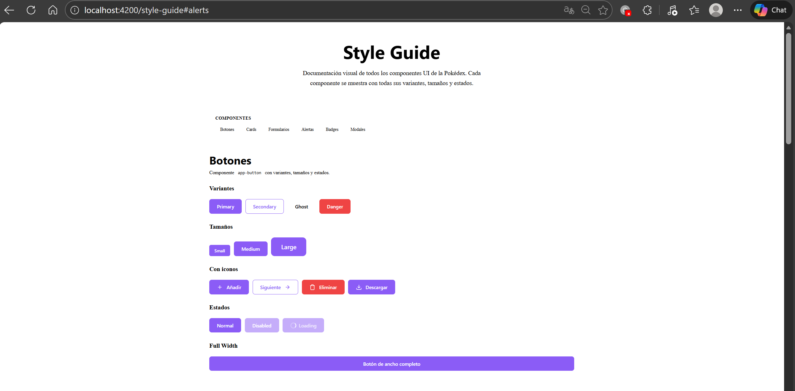
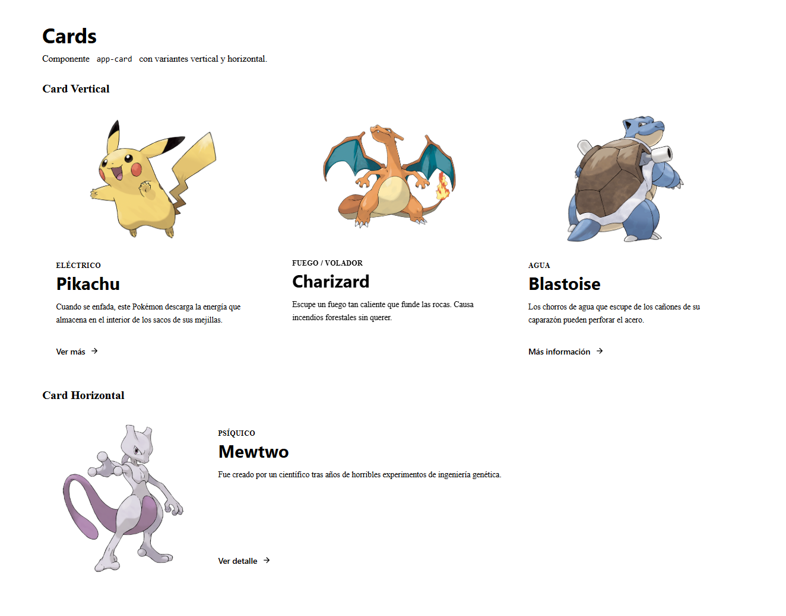
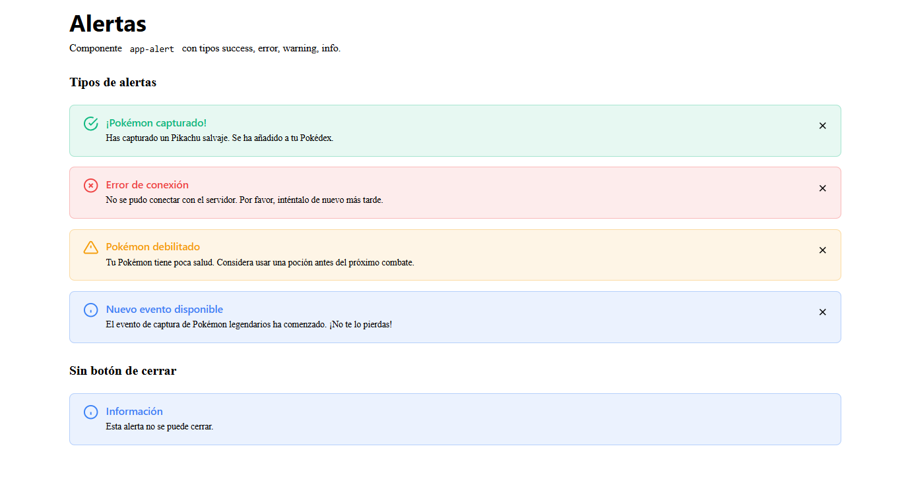

# Sección 3: Sistema de Componentes UI

## Índice
- [3.1 Componentes implementados](#31-componentes-implementados)
- [3.2 Nomenclatura y metodología BEM](#32-nomenclatura-y-metodología-bem)
- [3.3 Style Guide](#33-style-guide)

---

## 3.1 Componentes Implementados

### Resumen de componentes

| Componente | Tipo | Ubicación | Estado |
|------------|------|-----------|--------|
| `app-button` | Obligatorio | `components/shared/button/` | ✅ |
| `app-card` | Obligatorio | `components/shared/card/` | ✅ |
| `app-form-textarea` | Obligatorio | `components/shared/form-textarea/` | ✅ |
| `app-form-select` | Obligatorio | `components/shared/form-select/` | ✅ |
| `app-alert` | Obligatorio | `components/shared/alert/` | ✅ |
| `app-badge` | Opcional | `components/shared/badge/` | ✅ |
| `app-modal` | Opcional | `components/shared/modal/` | ✅ |

---

### 3.1.1 Button (`app-button`)

**Propósito**: Botón reutilizable para acciones en toda la aplicación.

**Variantes disponibles**:
- `primary` - Acción principal (morado)
- `secondary` - Acción secundaria (outline)
- `ghost` - Sin fondo ni borde
- `danger` - Acción destructiva (rojo)

**Tamaños disponibles**:
- `sm` - Pequeño (padding reducido)
- `md` - Mediano (por defecto)
- `lg` - Grande (padding ampliado)

**Estados**:
- Normal
- `:hover` - Elevación y cambio de color
- `:focus` - Outline visible para accesibilidad
- `:active` - Efecto de presión
- `disabled` - Opacidad reducida, no clickeable
- `loading` - Spinner de carga

**Ejemplo de uso**:
```html
<!-- Botón primario -->
<app-button variant="primary" size="md">
  Guardar
</app-button>

<!-- Botón con icono -->
<app-button variant="danger" iconLeft="trash">
  Eliminar
</app-button>

<!-- Botón en estado de carga -->
<app-button variant="primary" [loading]="isLoading">
  Procesando...
</app-button>

<!-- Botón deshabilitado -->
<app-button variant="secondary" [disabled]="true">
  No disponible
</app-button>
```

---

### 3.1.2 Card (`app-card`)

**Propósito**: Tarjeta para mostrar contenido con imagen, título y descripción.

**Variantes disponibles**:
- `vertical` - Imagen arriba, contenido abajo (por defecto)
- `horizontal` - Imagen a la izquierda, contenido a la derecha

**Estados**:
- Normal
- `:hover` - Elevación de sombra, zoom en imagen
- `clickable` - Toda la card es clickeable
- `elevated` - Sombra elevada por defecto

**Ejemplo de uso**:
```html
<!-- Card vertical básica -->
<app-card
  variant="vertical"
  imageUrl="pikachu.png"
  title="Pikachu"
  subtitle="Eléctrico"
  description="Un Pokémon muy famoso..."
  actionText="Ver más"
  (actionClick)="verDetalle()">
</app-card>

<!-- Card horizontal clickeable -->
<app-card
  variant="horizontal"
  [clickable]="true"
  imageUrl="charizard.png"
  title="Charizard"
  (cardClick)="seleccionar()">
</app-card>
```

---

### 3.1.3 Form Textarea (`app-form-textarea`)

**Propósito**: Área de texto multilínea para formularios.

**Características**:
- Label asociado al textarea
- Indicador de campo requerido (*)
- Contador de caracteres opcional
- Mensaje de error
- Texto de ayuda

**Estados**:
- Normal
- `focused` - Borde primario
- `filled` - Con valor
- `error` - Borde rojo, mensaje de error
- `disabled` - No editable

**Ejemplo de uso**:
```html
<app-form-textarea
  textareaId="descripcion"
  name="descripcion"
  label="Descripción"
  placeholder="Escribe una descripción..."
  [required]="true"
  [rows]="4"
  [maxlength]="500"
  [showCharCount]="true"
  helpText="Máximo 500 caracteres"
  [showError]="hasError"
  errorMessage="La descripción es obligatoria">
</app-form-textarea>
```

---

### 3.1.4 Form Select (`app-form-select`)

**Propósito**: Dropdown/selector para elegir una opción de una lista.

**Características**:
- Label asociado al select
- Placeholder
- Opciones dinámicas
- Mensaje de error
- Texto de ayuda
- Icono de flecha animado

**Estados**:
- Normal
- `focused` - Flecha rotada, borde primario
- `filled` - Con valor seleccionado
- `error` - Borde rojo
- `disabled` - No seleccionable

**Ejemplo de uso**:
```typescript
// En el componente
options: SelectOption[] = [
  { value: 'fire', label: 'Fuego' },
  { value: 'water', label: 'Agua' },
  { value: 'grass', label: 'Planta' }
];
```

```html
<app-form-select
  selectId="tipo"
  name="tipo"
  label="Tipo de Pokémon"
  placeholder="Selecciona un tipo"
  [options]="options"
  [required]="true"
  helpText="Elige el tipo principal">
</app-form-select>
```

---

### 3.1.5 Alert (`app-alert`)

**Propósito**: Mostrar mensajes de feedback al usuario.

**Tipos disponibles**:
- `success` - Confirmaciones (verde)
- `error` - Errores (rojo)
- `warning` - Advertencias (naranja)
- `info` - Información (azul)

**Características**:
- Icono según el tipo
- Título (opcional o por defecto)
- Mensaje
- Botón de cerrar (opcional)
- Animación de entrada

**Ejemplo de uso**:
```html
<!-- Alerta de éxito -->
<app-alert
  type="success"
  title="¡Pokémon capturado!"
  message="Se ha añadido a tu Pokédex."
  (closed)="onAlertClosed()">
</app-alert>

<!-- Alerta de error sin botón de cerrar -->
<app-alert
  type="error"
  message="Error de conexión"
  [dismissible]="false">
</app-alert>
```

---

### 3.1.6 Badge (`app-badge`)

**Propósito**: Etiquetas pequeñas para estados, categorías y contadores.

**Variantes**:
- `primary`, `secondary`, `success`, `error`, `warning`, `info`

**Tamaños**:
- `sm`, `md`, `lg`

**Modos especiales**:
- `outline` - Solo borde, sin fondo
- `dot` - Punto sin texto
- `count` - Contador de notificaciones

**Ejemplo de uso**:
```html
<!-- Badge normal -->
<app-badge variant="success">Activo</app-badge>

<!-- Badge outline -->
<app-badge variant="primary" [outline]="true">Nuevo</app-badge>

<!-- Contador de notificaciones -->
<app-badge variant="error" [count]="5"></app-badge>

<!-- Contador con máximo -->
<app-badge variant="error" [count]="150" [maxCount]="99"></app-badge>

<!-- Dot indicador -->
<app-badge variant="success" [dot]="true"></app-badge>
```

---

### 3.1.7 Modal (`app-modal`)

**Propósito**: Ventana superpuesta para contenido adicional.

**Tamaños**:
- `sm` - 400px
- `md` - 560px (por defecto)
- `lg` - 720px
- `xl` - 960px
- `full` - Casi pantalla completa

**Características**:
- Overlay oscuro
- Cierre con botón X
- Cierre con tecla ESC
- Cierre al hacer clic en overlay
- Bloqueo de scroll del body
- Slots para header, body y footer

**Ejemplo de uso**:
```html
<app-modal
  [isOpen]="isModalOpen"
  title="Confirmar acción"
  size="md"
  [closeOnEsc]="true"
  [closeOnOverlay]="true"
  (closed)="closeModal()">
  
  <p>¿Estás seguro de que quieres eliminar este Pokémon?</p>
  
  <div modal-footer>
    <app-button variant="ghost" (buttonClick)="closeModal()">
      Cancelar
    </app-button>
    <app-button variant="danger" (buttonClick)="confirmar()">
      Eliminar
    </app-button>
  </div>
  
</app-modal>
```

---

## 3.2 Nomenclatura y Metodología BEM

### ¿Qué es BEM?

BEM (Block Element Modifier) es una metodología de nomenclatura CSS que hace el código más legible y mantenible.

### Estructura BEM

```
.block                    → Componente independiente
.block__element           → Parte del bloque
.block--modifier          → Variante del bloque
.block__element--modifier → Variante del elemento
```

### Aplicación en los componentes

#### Block (Bloque)
El componente principal, independiente y reutilizable.

```scss
// El bloque es el componente
.button { ... }
.card { ... }
.alert { ... }
.form-input { ... }
```

#### Element (Elemento)
Partes internas del bloque que no tienen sentido fuera de él.

```scss
// Elementos del botón
.button__text { ... }
.button__icon { ... }
.button__spinner { ... }

// Elementos de la card
.card__image { ... }
.card__title { ... }
.card__description { ... }
.card__footer { ... }
```

#### Modifier (Modificador)
Variaciones de apariencia o estado.

```scss
// Modificadores de variante
.button--primary { ... }
.button--secondary { ... }
.button--danger { ... }

// Modificadores de tamaño
.button--sm { ... }
.button--md { ... }
.button--lg { ... }

// Modificadores de estado
.button--disabled { ... }
.button--loading { ... }
.form-input--error { ... }
.form-input--focused { ... }
```

### Ejemplos reales del proyecto

#### Ejemplo 1: Button
```scss
.button {                           // Block
  display: inline-flex;
  
  &__text { ... }                   // Element
  &__icon { ... }                   // Element
  &__spinner { ... }                // Element
  
  &--primary { ... }                // Modifier (variante)
  &--secondary { ... }              // Modifier (variante)
  &--sm { ... }                     // Modifier (tamaño)
  &--disabled { ... }               // Modifier (estado)
  
  &__icon--left { ... }             // Element + Modifier
  &__icon--right { ... }            // Element + Modifier
}
```

#### Ejemplo 2: Card
```scss
.card {                             // Block
  &__image-wrapper { ... }          // Element
  &__image { ... }                  // Element
  &__content { ... }                // Element
  &__title { ... }                  // Element
  &__description { ... }            // Element
  &__footer { ... }                 // Element
  &__action { ... }                 // Element
  
  &--vertical { ... }               // Modifier (variante)
  &--horizontal { ... }             // Modifier (variante)
  &--clickable { ... }              // Modifier (estado)
  &--elevated { ... }               // Modifier (estado)
}
```

#### Ejemplo 3: Alert
```scss
.alert {                            // Block
  &__icon { ... }                   // Element
  &__content { ... }                // Element
  &__title { ... }                  // Element
  &__message { ... }                // Element
  &__close { ... }                  // Element
  
  &--success { ... }                // Modifier (tipo)
  &--error { ... }                  // Modifier (tipo)
  &--warning { ... }                // Modifier (tipo)
  &--info { ... }                   // Modifier (tipo)
  &--dismissible { ... }            // Modifier (característica)
}
```

### Cuándo usar cada cosa

| Situación | Usar |
|-----------|------|
| Componente independiente | Block: `.card` |
| Parte interna del componente | Element: `.card__title` |
| Variante visual | Modifier: `.card--horizontal` |
| Estado interactivo | Modifier: `.button--disabled` |
| Tamaño | Modifier: `.button--lg` |
| Tipo/categoría | Modifier: `.alert--error` |

---

## 3.3 Style Guide

### ¿Qué es el Style Guide?

Es una página especial (`/style-guide`) que muestra todos los componentes UI con todas sus variantes. Sirve como:

1. **Documentación visual** - Ver cómo se ve cada componente.
2. **Testing rápido** - Verificar que todo funciona.
3. **Referencia para desarrollo** - Copiar código de ejemplo.
4. **Comunicación con diseño** - Mostrar el sistema de diseño.

### Acceso al Style Guide

```
http://localhost:4200/style-guide
```

### Estructura del Style Guide

El Style Guide está organizado por secciones:

1. **Botones** - Variantes, tamaños, iconos, estados.
2. **Cards** - Vertical, horizontal, clickable.
3. **Formularios** - Input, textarea, select.
4. **Alertas** - Success, error, warning, info.
5. **Badges** - Variantes, outline, contadores, dots.
6. **Modales** - Demo interactivo.

### Capturas del Style Guide



**Sección Botones:**
- Muestra las 4 variantes (primary, secondary, ghost, danger).
- Muestra los 3 tamaños (small, medium, large).
- Muestra botones con distintos tipos de iconos.
- Muestra estados (normal, disabled, loading).



**Sección Cards:**
- Cards verticales con imagen, nombre del pokemon, tipo y una descripción.
- Un card horizontal con imagen, nombre del pokemon, tipo y una descripción.



**Sección Formularios:**
- Inputs con diferentes tipos.
- Textareas con contador.
- Selects con opciones.



**Sección Alertas:**
- Los 4 tipos de alertas.
- Una alerta que no se puede cerrar.


**Sección Badges:**
- Todas las variantes de color.
- Versiones outline.
- Contadores y dots.


**Sección Modales:**
- Botón para abrir demo.
- Modal con header, body y footer (Esto se ve cuando se pincha en el botón Abrir Modal).
