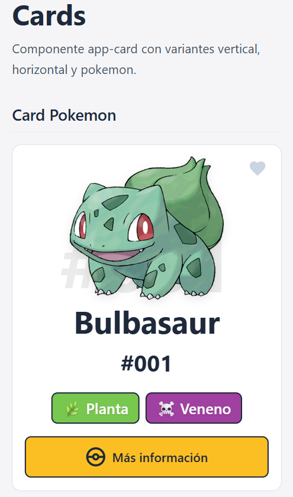
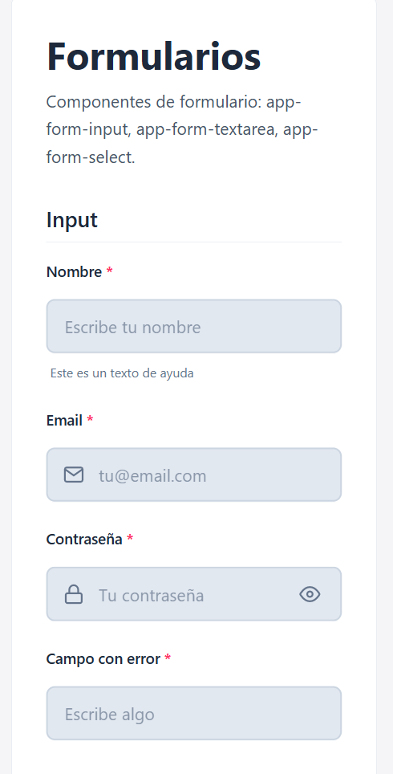
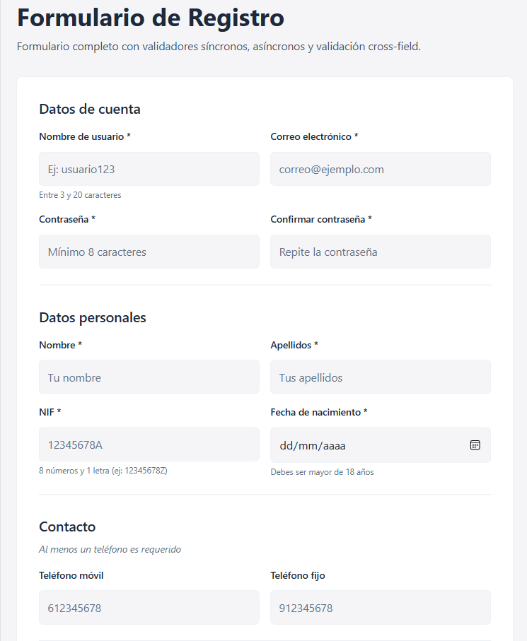
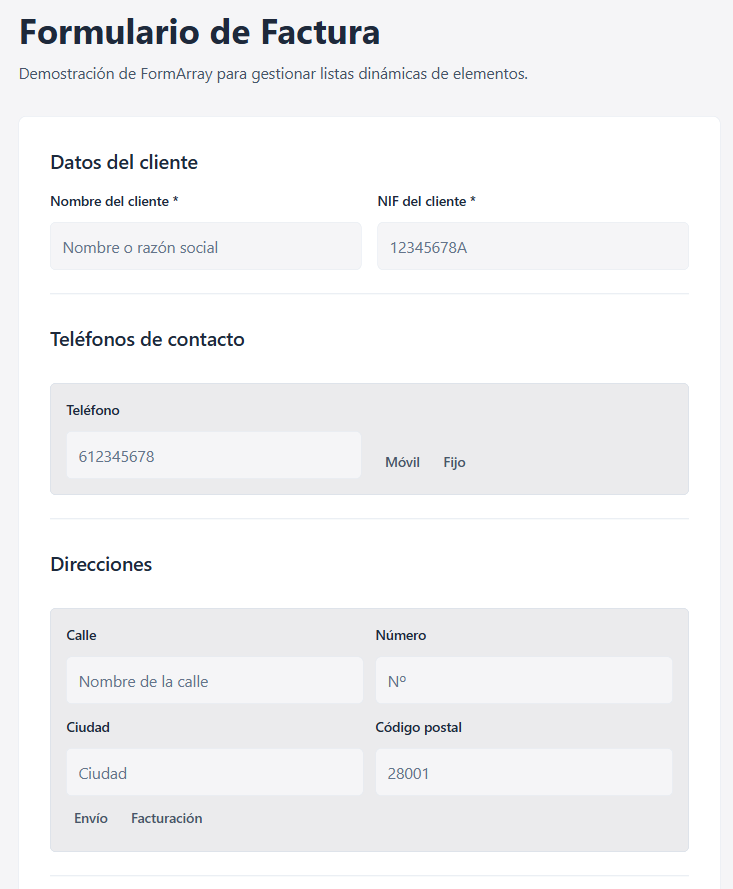
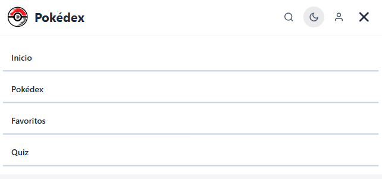
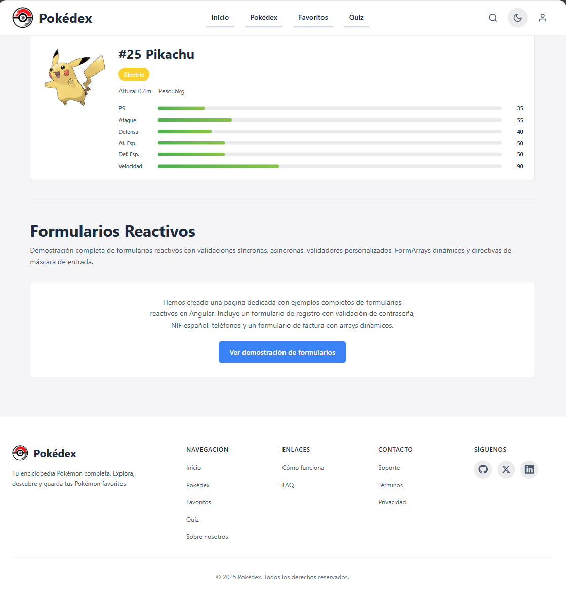

# Sección 4 Repsonsive design y layouts completos.

## Índice
- [4.1 Breakpoints definidos](#41-breakpoints-definidos)
- [4.2 Estrategia responsive elegida](#42-estrategia-responsive-elegida)
- [4.3 Container Queries](#43-container-queries)
- [4.4 Adaptaciones por componente](#44-adaptaciones-por-componente)
- [4.5 Testing en múltiples viewports](#45-testing-en-múltiples-viewports)
- [4.6 Screenshots comparativos](#46-screenshots-comparativos)

---

## 4.1 Breakpoints Definidos.

### Sistema de breakpoints:

| Breakpoint | Píxeles | Uso principal |
|------------|---------|---------------|
| `xs` | 320px | Móvil muy pequeño (iPhone SE, Galaxy S pequeños) |
| `sm` | 640px | Móvil grande (iPhone Pro Max, Galaxy Plus) |
| `md` | 768px | Tablet (iPad Mini, tablets Android) |
| `lg` | 1024px | Desktop pequeño / Tablet landscape |
| `xl` | 1280px | Desktop estándar |
| `2xl` | 1536px | Desktop grande / monitores anchos |

### Justificación de los valores:

- **320px (xs)**: Breakpoint mínimo que cubre los dispositivos móviles más pequeños del mercado (iPhone SE 1ra gen, Galaxy Fold plegado). Por debajo de este valor, el diseño se mantiene en su forma más compacta.

- **640px (sm)**: Punto donde los móviles más grandes empiezan a tener espacio suficiente para layouts de dos columnas en algunos contextos.

- **768px (md)**: Breakpoint estándar de la industria para tablets. El header cambia de menú hamburguesa a navegación horizontal.

- **1024px (lg)**: Desktop pequeño. El footer muestra todas sus columnas, los grids de cards pueden tener 3 columnas.

- **1280px (xl)**: Desktop estándar. Contenedores alcanzan su ancho máximo.

- **1536px (2xl)**: Para monitores muy anchos, permite espaciado adicional.


### Definición en código:

```scss
// _variables.scss
$breakpoint-xs: 320px;    // Móvil muy pequeño
$breakpoint-sm: 640px;    // Móvil grande
$breakpoint-md: 768px;    // Tablet
$breakpoint-lg: 1024px;   // Desktop
$breakpoint-xl: 1280px;   // Desktop grande
$breakpoint-2xl: 1536px;  // Desktop extra grande
```

---

## 4.2 Estrategia Responsive Elegida.

### Mobile-First

Este proyecto utiliza la estrategia **Mobile-First**, donde los estilos base están diseñados para móviles y se añaden media queries con `min-width` para pantallas más grandes.

### Justificación:

1. **Rendimiento**: Los dispositivos móviles cargan primero los estilos esenciales, sin descargar CSS innecesario.

2. **Priorización del contenido**: Obliga a diseñar pensando primero en lo esencial, evitando sobrecarga visual.

3. **Progresión natural**: Es más intuitivo añadir funcionalidades (columnas, espaciado) que quitarlas.

4. **Tendencia actual**: La mayoría del tráfico web proviene de dispositivos móviles.

### Mixin `respond-to`

```scss
// _mixins.scss
@mixin respond-to($breakpoint) {
  @if $breakpoint == 'xs' {
    @media (min-width: $breakpoint-xs) { @content; }
  }
  @else if $breakpoint == 'sm' {
    @media (min-width: $breakpoint-sm) { @content; }
  }
  @else if $breakpoint == 'md' {
    @media (min-width: $breakpoint-md) { @content; }
  }
  @else if $breakpoint == 'lg' {
    @media (min-width: $breakpoint-lg) { @content; }
  }
  @else if $breakpoint == 'xl' {
    @media (min-width: $breakpoint-xl) { @content; }
  }
  @else if $breakpoint == '2xl' {
    @media (min-width: $breakpoint-2xl) { @content; }
  }
}
```

### Ejemplo de uso en componentes:

```scss
// header.scss - Ejemplo Mobile-First
.header__nav {
  // Base: Móvil - menú oculto
  display: none;
  position: absolute;
  top: 100%;
  left: 0;
  right: 0;

  &--open {
    display: block;
  }

  // Desktop: navegación siempre visible
  @include respond-to('md') {
    display: block;
    position: static;
    background: transparent;
  }
}

.header__nav-list {
  // Base: Móvil - apilado vertical
  display: flex;
  flex-direction: column;
  gap: $spacing-2;

  // Desktop: horizontal
  @include respond-to('md') {
    flex-direction: row;
    gap: $spacing-6;
  }
}
```

---

## 4.3 Container Queries.

### ¿Qué son las Container Queries?

Las Container Queries permiten que un componente se adapte al tamaño de su contenedor padre, no al viewport. Esto hace que los componentes sean verdaderamente reutilizables e independientes del contexto donde se usen.

### Componentes con Container Queries:

#### 1. Card Component (`app-card`)

**Razón**: Las cards se usan en grids de diferentes columnas. Con Container Queries, una card puede ser vertical en un grid de 3 columnas y horizontal en un grid de 1 columna, sin necesidad de cambiar props.

```scss
// card.scss
:host {
  display: block;
  container-type: inline-size;
  container-name: card-container;
}

.card--responsive {
  // Base: vertical (contenedores pequeños)
  flex-direction: column;

  .card__image-wrapper {
    width: 100%;
    height: 180px;
  }

  // Contenedor > 400px: horizontal
  @container card-container (min-width: 400px) {
    flex-direction: row;

    .card__image-wrapper {
      width: 40%;
      min-width: 150px;
      max-width: 200px;
      height: auto;
    }
  }

  // Contenedor > 600px: más espacio
  @container card-container (min-width: 600px) {
    .card__image-wrapper {
      width: 35%;
      max-width: 250px;
    }

    .card__title {
      font-size: $font-size-2xl;
    }
  }
}
```

**Uso**:
```html
<app-card variant="responsive" [title]="'Título'" [imageUrl]="'...'"></app-card>
```

#### 2. Alert Component (`app-alert`)

**Razón**: Los alerts pueden aparecer en sidebars estrechos, modales, o en el contenido principal. Con Container Queries, se adaptan automáticamente.

```scss
// alert.scss
:host {
  display: block;
  container-type: inline-size;
  container-name: alert-container;
}

.alert--compact {
  // Contenedores muy pequeños: layout vertical
  @container alert-container (max-width: 300px) {
    flex-direction: column;
    text-align: center;
    gap: $spacing-2;

    .alert__icon {
      align-self: center;
      svg { width: 32px; height: 32px; }
    }
  }

  // Contenedores medianos: compacto horizontal
  @container alert-container (min-width: 301px) and (max-width: 500px) {
    padding: $spacing-3 $spacing-4;

    .alert__title { font-size: $font-size-sm; }
    .alert__message { font-size: $font-size-xs; }
  }

  // Contenedores grandes: estilo completo
  @container alert-container (min-width: 501px) {
    padding: $spacing-4 $spacing-6;

    .alert__title { font-size: $font-size-lg; }
  }
}
```

**Uso**:
```html
<app-alert [compact]="true" type="info" title="Nota" message="..."></app-alert>
```

### Beneficios de Container Queries

1. **Componentes reutilizables**: El mismo componente funciona en cualquier contexto.
2. **Menos props**: No necesitas pasar `size="sm"` o `layout="horizontal"`.
3. **Mantenimiento**: Los estilos viven en el componente, no en el padre.
4. **Testing**: Más fácil de probar al no depender del viewport global.

---

## 4.4 Adaptaciones por Componente.

### Header

| Viewport | Comportamiento |
|----------|----------------|
| Mobile (<768px) | Menú hamburguesa, navegación en dropdown vertical |
| Desktop (≥768px) | Navegación horizontal visible, sin hamburguesa |

**Elementos que cambian**:
- Logo: 40px → 48px
- Nav: dropdown vertical → horizontal inline
- Botones de acción: 40px → 44px
- Botón hamburguesa: visible → oculto

### Footer

| Viewport | Comportamiento |
|----------|----------------|
| Mobile (<640px) | Una columna, todo apilado |
| Tablet (640-767px) | 2 columnas |
| Tablet (768-1023px) | 3 columnas |
| Desktop (≥1024px) | 5 columnas (2fr 1fr 1fr 1fr 1fr) |

### Cards

| Viewport | Comportamiento |
|----------|----------------|
| Mobile (<640px) | 1 columna, cards verticales |
| Tablet (640-1023px) | 2 columnas |
| Desktop (≥1024px) | 3+ columnas |

**Variante horizontal**: En mobile se convierte automáticamente en vertical.

### Formularios

| Viewport | Comportamiento |
|----------|----------------|
| Mobile (<640px) | Campos apilados, 1 columna |
| Desktop (≥640px) | Grid de 2 columnas |

**Tablas de items (factura)**:
- Mobile: Cada fila es una "card" con labels visibles
- Desktop: Tabla tradicional con headers

### Alerts

- Mobile: Padding reducido, texto más pequeño
- Desktop: Padding completo

### Botones

- Dentro de formularios en mobile: `width: 100%` cuando se necesita
- Desktop: Ancho automático

---

## 4.5 Testing en múltiples viewports.

### Viewports testeados:

Todas las páginas de la aplicación han sido verificadas en los siguientes 5 viewports para garantizar una experiencia consistente y responsive:

| Viewport | Ancho | Dispositivo de referencia | Estado |
|----------|-------|---------------------------|--------|
| **320px** | 320px × 568px | iPhone SE (1ra gen), móviles muy pequeños | Verificado |
| **375px** | 375px × 667px | iPhone 8/SE (2da gen), móviles estándar | Verificado |
| **768px** | 768px × 1024px | iPad Mini, tablets en portrait | Verificado |
| **1024px** | 1024px × 768px | iPad landscape, desktops pequeños | Verificado |
| **1280px** | 1280px × 720px | Desktop estándar (1280x720, 1366x768) | Verificado |


### Páginas testeadas:

Todas las siguientes páginas funcionan correctamente en los 5 viewports mencionados:

#### Páginas públicas:
- **Home** (`/`) - Hero section, grid de features
- **Login** (`/login`) - Formulario de login responsive
- **Register** (`/register`) - Formulario de registro
- **Not Found** (`/404`) - Página de error 404

#### Páginas de Pokémon:
- **Pokédex** (`/pokedex`) - Grid responsive (1/2/3/4 columnas según viewport)
- **Detalle Pokémon** (`/pokemon/:id`) - Layout adaptativo con estadísticas

#### Páginas de Quiz:
- **Quiz** (`/quiz`) - Lista de quizzes disponibles
- **Quiz Play** (`/quiz/:id/play`) - Interfaz de juego responsive
- **Quiz Results** (`/quiz/:id/results`) - Resultados adaptativos
- **Quiz Review** (`/quiz/:id/review`) - Revisión de respuestas

#### Páginas de usuario:
- **Profile** (`/profile`) - Formulario de perfil
- **Settings** (`/settings`) - Panel de ajustes


### Adaptaciones clave por viewport:

#### **320px - Móvil muy pequeño**
- Grid de Pokédex: **1 columna**
- Cards de Pokémon: Layout vertical compacto.
- Header: Menú hamburguesa.
- Footer: 1 columna, elementos apilados.
- Formularios: Campos de ancho completo.

#### **375px - Móvil estándar**
- Grid de Pokédex: **1 columna** (más espaciado).
- Cards: Mejor legibilidad de texto.
- Botones: Tamaño táctil óptimo (44px+).

#### **768px - Tablet**
- Grid de Pokédex: **2 columnas**
- Header: Navegación horizontal visible.
- Footer: 3 columnas.
- Formularios: Grid de 2 columnas para campos relacionados.

#### **1024px - Desktop pequeño**
- Grid de Pokédex: **3 columnas**
- Footer: 5 columnas completas.
- Quiz: Layout con sidebar.

#### **1280px - Desktop estándar**
- Grid de Pokédex: **4 columnas**
- Contenedores: Ancho máximo alcanzado.
- Espaciado: Máximo confort visual.

### Método de testing:

El testing se realizó utilizando:
1. **Chrome DevTools** - Device Toolbar con viewports personalizados.
2. **Responsive Design Mode** - Para verificar transiciones entre breakpoints.
3. **Testing real** - Dispositivos físicos para validar touch targets y gestos.


### Criterios de validación:

Para cada viewport se verificó:
- **Legibilidad**: Texto legible sin zoom (mínimo 14px en móvil).
- **Touch targets**: Botones de mínimo 44×44px en móvil.
- **Scroll horizontal**: Sin desbordamiento horizontal.
- **Imágenes**: Carga correcta y aspect ratio preservado.
- **Navegación**: Acceso completo a todas las funcionalidades.
- **Formularios**: Campos usables y labels visibles.

---

## 4.6 Screenshots comparativos.

### Viewports a capturar:

1. **Mobile. Style Guide.**
  
  
  

2. **Tablet. (Forms Demo)**
  
  

3. **Desktop. (Header y Footer)**
   
   

